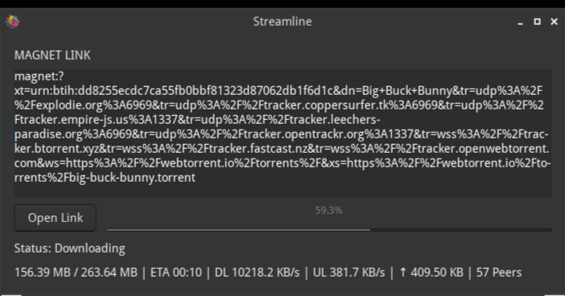

# Streamline

A lightweight GTK-based BitTorrent client written in Python using **libtorrent**. Streamline provides a simple graphical interface for downloading torrents directly from magnet links while displaying live download statistics.


## Features

- Clean GTK3 interface
- Paste and download magnet links
- Automatic metadata retrieval
- Live download progress
- Download speed monitor
- Upload speed monitor
- ETA calculation
- Peer count display
- Upload statistics
- Seeding after completion
- Supports opening magnet links from the command line

## Screenshot



## Requirements

- Python 3
- GTK 3
- PyGObject
- libtorrent (Python bindings)

## Installation

### Debian / Ubuntu

```bash
sudo apt install python3-gi gir1.2-gtk-3.0 python3-libtorrent
```

Clone the repository:

```bash
git clone https://github.com/yourusername/streamline.git
cd streamline
```

Run:

```bash
python3 streamline.py
```

## Usage

### Open normally

```bash
python3 streamline.py
```

Paste a magnet link into the text box and click **Open Link**.

### Open from a magnet link

```bash
python3 streamline.py "magnet:?xt=urn:btih:..."
```

The download will start automatically.

## Download Location

By default torrents are saved to:

```text
/mnt/home/data/torrent
```

You can change the download directory by editing:

```python
params.save_path = "/mnt/home/data/torrent"
```

## Project Structure

```
streamline/
├── streamline.py
├── README.md
└── LICENSE
```

## Built With

- Python
- GTK3 (PyGObject)
- libtorrent

## Current Features

- ✅ Magnet URI support
- ✅ Metadata fetching
- ✅ Progress bar
- ✅ Download statistics
- ✅ Upload statistics
- ✅ ETA estimation
- ✅ Peer counter
- ✅ Automatic seeding
- ✅ Command-line magnet support

## License

This project is licensed under the MIT License.

## Contributing

Contributions, bug reports, and feature requests are welcome.

1. Fork the repository.
2. Create a feature branch.
3. Commit your changes.
4. Open a Pull Request.

## Acknowledgements

- libtorrent
- GTK
- PyGObject
